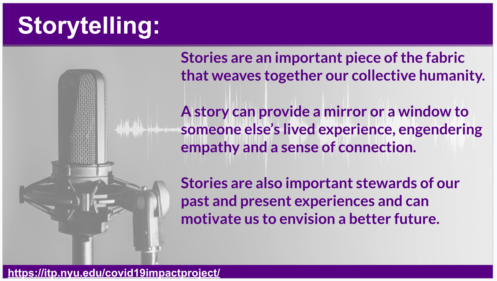

# Week 5

<!-- ## MORE LINKS ON MEMORIALIZATION

- https://www.nytimes.com/2021/05/21/nyregion/nyc-virus-memorials.html
- https://covidmemorial.online/
- https://metro.co.uk/2021/10/30/memorials-created-around-the-world-for-those-who-have-died-in-pandemic-15514162/
- https://www.theverge.com/2021/6/5/22520169/memorials-to-honor-covid-19-dead-begin-to-take-shape
- https://www.usnews.com/news/best-states/washington-dc/articles/2021-10-30/covid-19-memorial-creators-reflect-as-world-nears-5m-deaths

## "DATA HUMANISM": Giorgia Lupi
We will explore the concept of "Data Humanism" by examining the philosophy and work of noted data artist Giorgia Lupi
- http://giorgialupi.com/ -->

## CLASSROOM ACTIVITIES
### PRESENTATIONS OF PROJECT CONCEPT AND FIRST ITERATIONS

### Class Google Drive

Before the Class: please upload all of your project assets into your individual folder on our shared [Google Drive](https://drive.google.com/drive/folders/10LzZNPTCnpLnLxpQN9ewITFg9ku76L9l?usp=sharing)

### In Class Presentations PART 1:

<!-- **ALL presentations are in person**

All presentations will be recorded using Zoom. Although we are all in the classroom, we will ask each of you to conduct your presentation using the screen sharing technology that Zoom offers. So please be sure to bring your laptops to class or check one out from the ER if you need to. You only have to log in when it is your turn to present.

**To join the Zoom Meeting**
https://nyu.zoom.us/j/shindymelaniejones -->

### Course Project Feedback

An important part of the final class is student feedback on the projects of your peers. We have found that this is invaluable especially for students who intend to pursue their project beyond the 3 week class.

- Verbal feedback: (self explanatory)
- Written feedback:
  Please use this [Google Doc](https://docs.google.com/document/d/1X0ctAIQgSPUy_RaskWOxGr9BiTLJ9XaZmBmWhDhW3Sg/edit) to write your feedback in the row with the presenter's name and add your initials. A sample is in the doc.

## STORYTELLING

- Stories are an important piece of the fabric that weaves together our collective humanity.
- A story can provide a mirror or a window to someone else’s lived experience, engendering empathy and a sense of connection.
- Stories are also important stewards of our past and present experiences and can motivate us to envision a better future.

### Examples of slow data storytelling: 
**Data Visualization Projects by [Matt Korostoff](https://mkorostoff.github.io/)**

Matt is a software developer who proclaims himself waging a "war on [scope insensitivity](https://www.lesswrong.com/posts/2ftJ38y9SRBCBsCzy/scope-insensitivity)."
- [How much Money?](https://mkorostoff.github.io/1-pixel-wealth/) Full of surprises, this visualizatoin takes you on a ride that will question your understanding of wealth, money and poverty.
- [Incaceration in the United States](https://mkorostoff.github.io/incarceration-in-real-numbers/) Similarly using simple interactions, this data artist forces us to slow down and think about the United State's culture of imprisonment.

## RESEARCH AND DOCUMENTATION & CITATION OF DATA SOURCES
### Matt Korostoff's Vizzies
- [Pixel Wealth documentation](https://github.com/MKorostoff/1-pixel-wealth/blob/master/README.md)
- [Incarceration documentation](https://github.com/MKorostoff/incarceration-in-real-numbers/blob/master/README.md)

### John Henry's Mobile Flag App
- John Henry's [Mobile Flag App](https://github.com/molab-itp/99-Flag-Flow) Visualizing Flags of the World using the data source from the Github below:
- Github data for [Country Flag Visualization](
https://github.com/linssen/country-flag-icons/tree/master
)

### COVID-19 Impact Project: NYC Income Data
- [Median Household Income in the Past 12 Months](https://censusreporter.org/data/map/?table=B19013&geo_ids=04000US36,860|04000US36&primary_geo_id=04000US36#column|B19013001,sumlev|860) (In 2021 Inflation-adjusted Dollars)
- Github for [NYC Income Data](https://github.com/leey611/nyc-covid-map)

## HOMEWORK
### Final Project
Work on the second iteration of your project. Incorporate feedback from this week's class.  
#### For Week 6
- Title
- Brief description/Abstract/Concept
- Methodology
- What you learned
- Questions remaining
- Next steps

## REMINDERS
Your homework assignments constitute an important part of your grade.  Please check each week on the syllabus to make sure that you have completed all of the assignments. **LAST DATE TO MAKE UP MISSING OR IMCOMPLETE ASSIGNMENTS IS 12/14/2023**

<!-- ## CLASSROOM GUEST

Our classroom will be visited by [Tyler Peppel](https://www.linkedin.com/in/tylerpeppel/), an entrepreneur in the data visualization business who is interested in the COVID-19 Impact Project.

## EVALUATIONS:

The final evaluations for the course are due today 03/21/2022. You will be given some time after the presentations to complete your evaluations. Evaluations are confidential and help us to improve on the course. Thank you in advance for your feedback. -->
