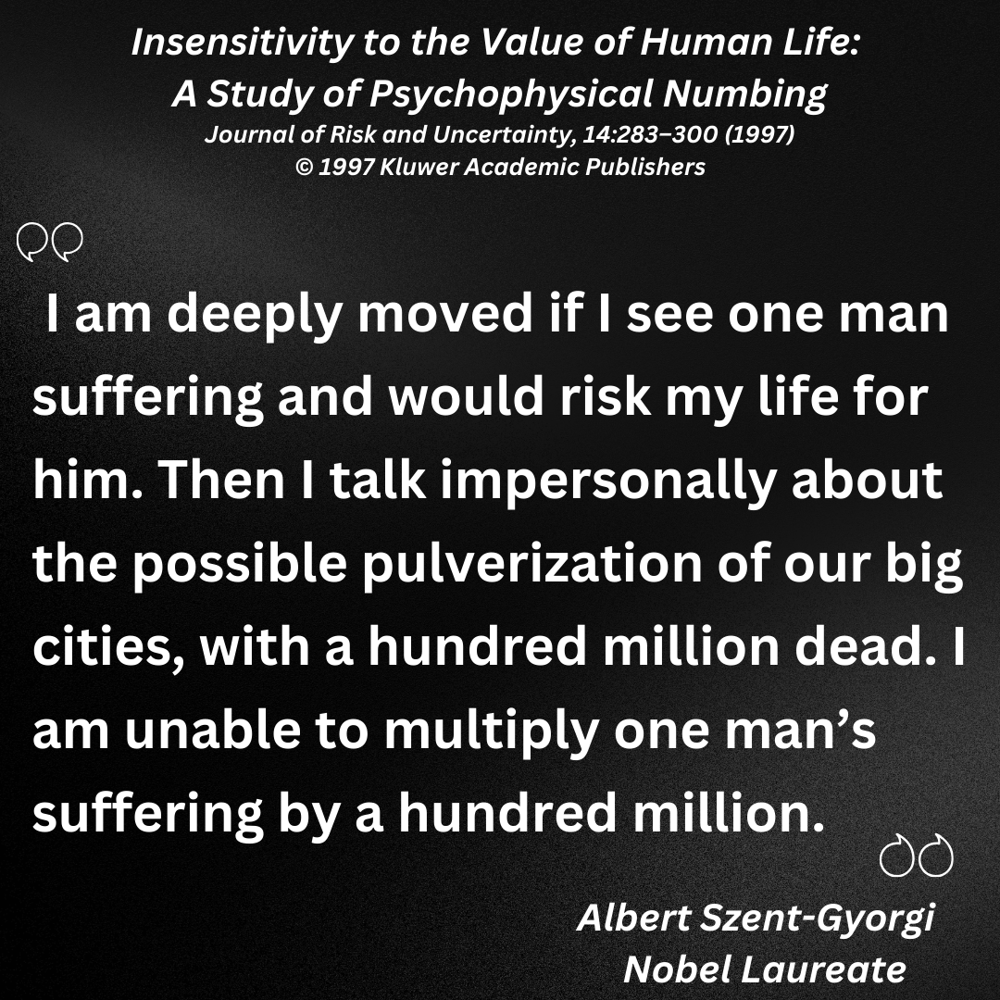

## Coming Soon!
# Week 6

## FINAL PRESENTATIONS 2nd ITERATION

### Class Google Drive

Please upload all of your project assets into your individual folder on our shared [Google Drive](https://drive.google.com/drive/folders/10LzZNPTCnpLnLxpQN9ewITFg9ku76L9l).

### In Class Presentations

The Class will be recorded using Zoom. Although we are all in the classroom, we will ask each of you to conduct your presentation using the screen sharing technology that Zoom offers. So please be sure to bring your laptops to class or check one out from the ER if you need to. You only have to log in when it is your turn to present.

**To join the Zoom Meeting**
https://nyu.zoom.us/my/john.henry.thompson

### Final Project Feedback

An important part of the final class is student feedback on the projects of your peers. We have found that this is invaluable especially for students who intend to pursue their project beyond the 3 week class.

- Verbal feedback: (self explanatory)
- Written feedback:
  Please use this [Google Doc](https://docs.google.com/document/d/1X0ctAIQgSPUy_RaskWOxGr9BiTLJ9XaZmBmWhDhW3Sg/edit
  ) to write your feedback in the row with the presenter's name and add your initials. A sample is in the doc.
## SCOPE INSENSITIVITY OR SCOPE NEGLECT
### Why do we wrestle with these numbers?

- https://www.lesswrong.com/posts/2ftJ38y9SRBCBsCzy/scope-insensitivity

## MEMORY MAKING

### COVID-19 IMPACT PROJECT DIGITAL MEMORIAL

### Mass Death Events
- [**COVID-19 Ticker**] (https://itp.nyu.edu/covid19impactproject/memorials/)

### Centering the Individual
- [Remembering the New Yorkers We’ve Lost to‌ COVID‑19  The City.NYC](https://projects.thecity.nyc/covid-19-deaths/)

- [2021-02-26
Marking 500k+ deaths by acknowledging this individual impacted by pandemic.](https://github.com/jht9629-nyu/covid-19-data-stories/blob/main/jht/2021-02-26-Roberto-Tobias-Jr.md)

- **COVID-19 Memorial Ideation** [Mabel Thompson, Walter Thompson](https://jht1493.net/Pilot/the-city-nyc/dots/)

- [Loop of 10 interviews](https://jht1493.net/Pilot/rusty-sync)

- [**Student Projects**](https://itp.nyu.edu/covid19impactproject/data-storytelling/)

## OTHER MEMORIALS
- https://www.nytimes.com/2021/05/21/nyregion/nyc-virus-memorials.html
- https://covidmemorial.online/
- https://metro.co.uk/2021/10/30/memorials-created-around-the-world-for-those-who-have-died-in-pandemic-15514162/
- https://www.theverge.com/2021/6/5/22520169/memorials-to-honor-covid-19-dead-begin-to-take-shape
- https://www.usnews.com/news/best-states/washington-dc/articles/2021-10-30/covid-19-memorial-creators-reflect-as-world-nears-5m-deaths

## "DATA HUMANISM": Giorgia Lupi

- http://giorgialupi.com/

## CLASSROOM GUEST

Our classroom will be visited by [Tyler Peppel](https://www.linkedin.com/in/tylerpeppel/), an entrepreneur in the data visualization business. Tyler is a senior advisor to the COVID-19 Impact Project.

## EVALUATIONS

Please complete your final evaluations for the course. Evaluations are confidential and help us to improve on the course. Thank you in advance for your feedback.-->
